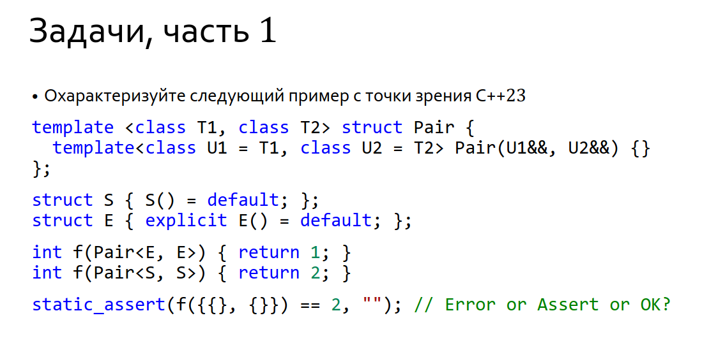

There was a proposal to standard decribed this problem: (Change in 12.2.2.4 [over.match.ctor] paragraph (https://www.open-std.org/jtc1/sc22/wg21/docs/cwg_defects.html 2856. Copy-list-initialization with explicit default constructors))

According to the last changes, let's consider 12.2.2.4 Initialization by constructor ([over.match.ctor])

```
When objects of class type are direct-initialized, copy-initialized from an expression of the same or a derived class type (our case), or default-initialized, overload resolution selects the constructor. 
```

In our case we have copy-list-initialization (according to 9.4.5).

```
For direct-initialization or default-initialization (including default-initialization in the context of copy-list-initialization), the candidate functions are all the constructors of the class of the object being initialized. Otherwise, the candidate functions are all the converting constructors (11.4.8.2 [class.conv.ctor]) of that class. The argument list is the expression-list or assignment-expression of the initializer. For default-initialization in the context of copy-list-initialization, if an explicit constructor is chosen, the initialization is ill-formed.
```

So, there is no ways to a compiler to cosider explicit constructors as a candidates in this overload set. The assert is OK in this case. 