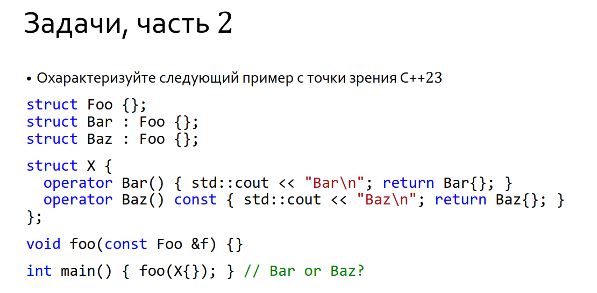

There are several consecutive aspects need to be considered for resolving this problem.

According to the 9.4.4

```
A variable whose declared type is “reference to T” (9.3.4.3) shall be initialized.
```

So, there are several rules how `const Foo &` can be initialized via `struct X` prvalue

```
A reference to type “cv1 T1” is initialized by an expression of type “cv2 T2” as follows:
(5.1)   — If the reference is an lvalue reference and the initializer expression
(5.1.1) — is an lvalue (but is not a bit-field), and “cv1 T1” is reference-compatible with “cv2 T2”, or
(5.1.2) — has a class type (i.e., T2 is a class type), where T1 is not reference-related to T2, and can be
converted to an lvalue of type “cv3 T3”, where “cv1 T1” is reference-compatible with “cv3 T3”86
(this conversion is selected by enumerating the applicable conversion functions (12.2.2.7) and
choosing the best one through overload resolution (12.2)),

then the reference binds to the initializer expression lvalue in the first case and to the lvalue result
of the conversion in the second case (or, in either case, to the appropriate base class subobject of the
object).
```

Since `cv X &` is not reference related to `const Foo &` according to 9.4.4.4, we only can consider the case (5.1.2)

The rules of choosing applicable conversion functions described in paragraph (12.2.2.7). According to the 

```
The permissible types for non-explicit conversion functions are the members of R where “cv1 T” is reference-compatible ([dcl.init.ref]) with “cv2 T2”.
For direct-initialization, the permissible types for explicit conversion functions are the members of R where T2 can be converted to type T with a (possibly trivial) qualification conversion ([conv.qual]); otherwise there are none.
```

Both of operators are candidates. Meanwhile, they have different rank (12.2.4.3) because (according to the 12.2.4.3.3.2.6) there are less conversion for `X` object to call non-const method. (promotion to const VS no any promotions to pass as `this` param to conversion operator). 

All in all, this example doesn't have any ambiguity. Both of top-of-truck compilers (clang/gcc) are right.

https://godbolt.org/z/9164e6ebh

