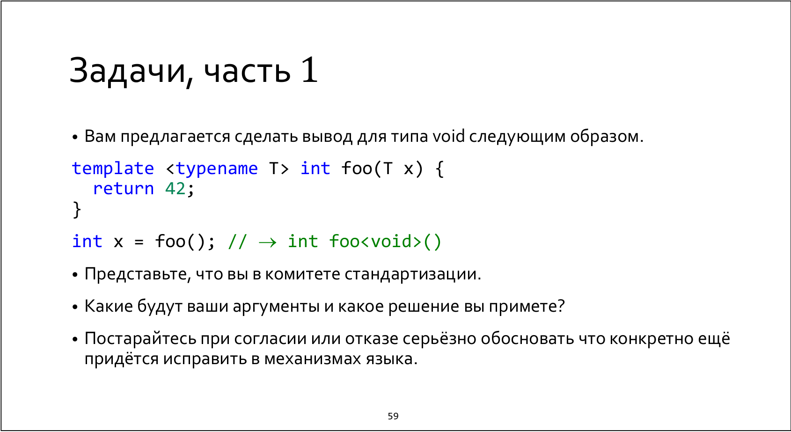
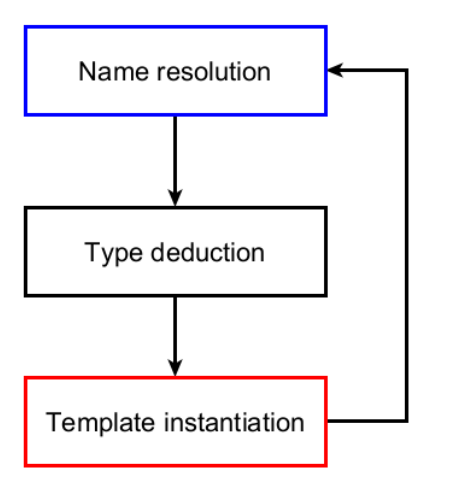

Suppose someone (defenetely not you :)) wants to provide this feature as a proposal in the nearest not-frozen standard. 

Preventively, we will try to prove to the person that this is not a good idea. However, in the process of reasoning, we can suddenly realize that it may even be useful.

To start with, we need to understand, which processes we need to changed most of all in case this proposal would be accepted. 

The aim is to construct a specialization `int foo<void>()` of template `template<typename T> int foo(T x)` in context of calling `foo()`. Let's consider "the normal semantic process":



According ot 12.2.2 and 12.2.2.8, after name lookup's collected candidates, in case we have a function template, there is a following rule 

```
In each case where a candidate is a function template, candidate function template specializations are
generated using template argument deduction (13.10.4, 13.10.3).
```

So, to collect candidate funciton specializations we need to launch the process of type deduction. Let's consider 13.10.3.1

```
When a function template specialization is referenced, all of the template arguments shall have values.
The values can be explicitly specified or, in some cases, be deduced from the use or obtained from default
template-arguments.
```

According to the text above, there are three ways to deduce a type: 
* explicitly specify (something like `foo<void>()`)
* deduce from the context (f.e from the passed params)
* obtained from default template-arguments

And there is a first change we need to apply for our patch: the type's not explicitly specified, we have no any context to deduce any type here, 
and there is no default template-arguments, so we can add a new rule for our case to deduce `void` by default, if there is a function template with one template 
argument has no any context to be deduced.

So we get

* explicitly specify
* deduce from the context 
* obtained from default template-arguments
* **deduce `void` by default, if there is a function template with one template argument has no any context to be deduced**

In this case, we have a new candidate funciton specialization, that can be viable (12.2.3).

But there is an example, that break our changes:

Let's consider

```
template<typename T>
int foo(T x) {
    return 1;
}

template<typename T = void> 
int foo() {
    return 2;
}

foo(); // 2
```

There is an example that works for current C++ (the second one will be called, the first one is not viable). But with our changes we provoke an ambiguity,
that is dangerous for backward compatibility. To fix it we need to intergate a lot of tricky changes ("crutches") through all over the standrad (mark some 
function as "specially deduced" and so on). Moreover, non-deducable context (13.10.3.6.5) is a useful thing (for example, for `std::forward`), so sometimes 
we have when we don't want to deduce a type.

In conclusion, I would like to provide a legendary quatation:

```
I don't think there's much to say here. My prior point still stands. I find your
proposed reading of the specification unconvincing. The optimization as proposed is
unsound.
I am not particularly interested in this optimization. Unless you have a strong
motivation to pursue this – in which case, please explain why – I'd suggest we
abandon this patch and move on with our lives
```