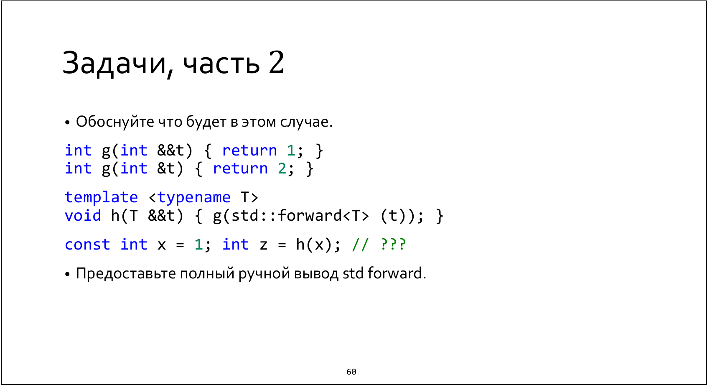

First of all, let's consider the status of `x`  expression in call `h(x)`. `x` is an lvalue expression of `const int` type, 
so according to 9.3.4.3.6 (reference collapsing rules), `T` for `h` template would be deduced as 
`const int &`. 

```
template <typename T /* const int & */>
void h(T && /* const int & */ t) { 
    g(std::forward<T> (t)); 
}
```

Then there is new reference collapsing of `const int &` inside `std::forward`, so because `T` has been deduced with reference, 
`std::forward` deduced `T` as `const int &` and return the same one.

In fact, `g` would apply `t` with `const int &` type, and there are no viable candidates (see 12.2.3 with more details in 12.2.3.2.5) in the overload set consists of 

```
int g(int &&t);
int g(int &t);
```

So we get a compilation error.