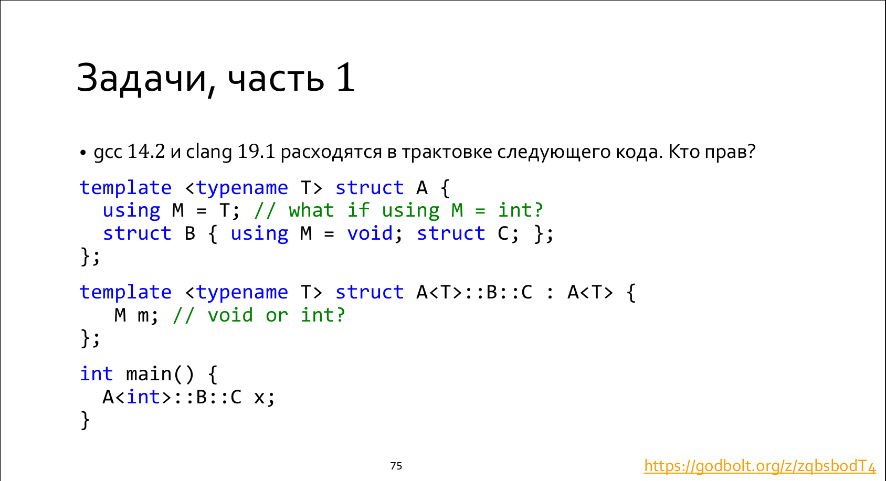

To resolve whether `M` is `void` or `int`, we need to study ruless for *member name lookup* described in point 6.5.2. According to the 6.5.2.4, if the set of candidates is empty in the immediate scope, we need to 

```
Calculate the lookup set for N in each direct non-dependent (13.8.3.2) base class subobject
Bi , and merge each such lookup set S(N, Bi ) in turn into S(N, C).
```

So we need to understand whether `A<T>` is dependent or independent base class subobject to find the name `M` 
associated with the template parameter `T`.

According to the point 13.8.3.2

```
A dependent base class is a base class that is a dependent type and is not the current instantiation.
Note 2 : A base class can be the current instantiation in the case of a nested class naming an enclosing class as a base.
```

our base class is the current instantiation, because `C` is a nested class for an enclosing class `A<T>`.

```
[Example 2 :
template<class T> struct A {
  typedef int M;
  struct B {
   typedef void M;
   struct C;
  };
};
template<class T> struct A<T>::B::C : A<T> {
  M m; // OK, A<T>::M
};
— end example]
```

 
it's is the **not-dependent** base class and we need to search the names through its scope. That's why **GCC is right here** and there is a bug in Clang basic name lookup.  

**P.S:**
It's easy to broke this example: https://godbolt.org/z/dWa495zq1

The base class becomes **dependent**, so it's failure.

**P.P.S:**
According to my searches, there is not a broken routine inside Clang: it just has no any support for this feature :)