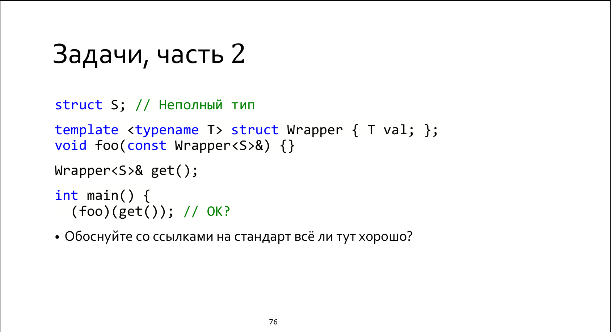

First of all, let's consider the similar example with compilation failure:

```
struct S; // Неполный тип
template <typename T> struct Wrapper { T val; };
  void foo(const Wrapper<S>&) {}

Wrapper<S>& get();

int main() {
  foo(get()); // FAIL
  ::foo(get()); // OK
}
```

As far as it was considered on the lecture, the first one is the unqualified name lookup, so it can be deligated to ADL that can require instantiation searching through associated set for S type, and the second one is the qualified one, so it doesn't enable ADL.

According to 6.5.4.1: 

```
When the postfix-expression in a function call (7.6.1.3) is an unqualified-id, 
and unqualified lookup (6.5.3) for the name in the unqualified-id does not find any
```

so ADL requires an ***unqualified-id***. Based on grammar rules provided in point 7.5.4.2 `foo` is unqualified-id, but `(foo)` is not. That's why ADL can not be enabled here, so there is no context of instantiation and the compilation is success.

**P.S:**

The standard even provides the same example with the following comments

```
[Example 1 :
namespace N {
  struct S { };
  void f(S);
}
void g() {
  N::S s;
  f(s); // OK, calls N::f
  (f)(s); // error: N::f not considered; parentheses prevent argument-dependent lookup
} 
— end example]
```

So, the parentheses is a way to disable ADL with your own hands :) 